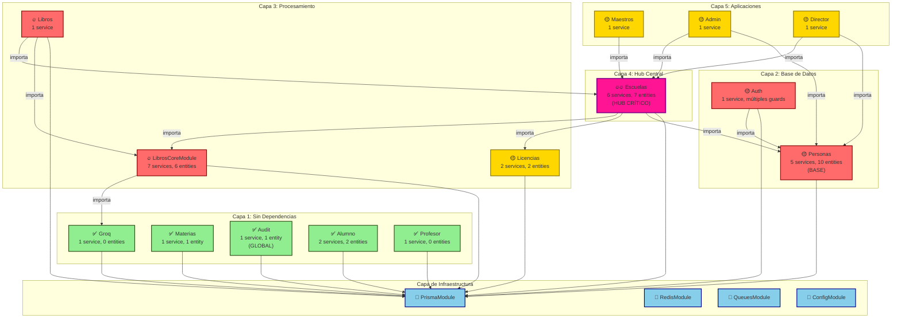
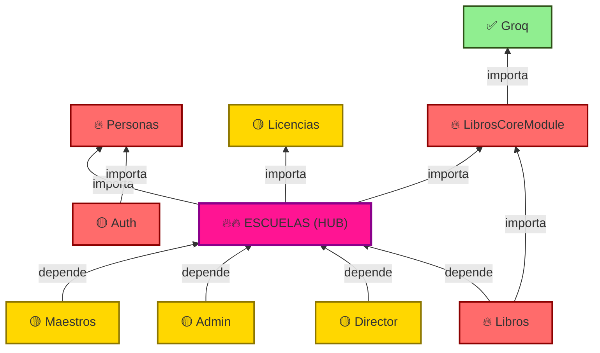
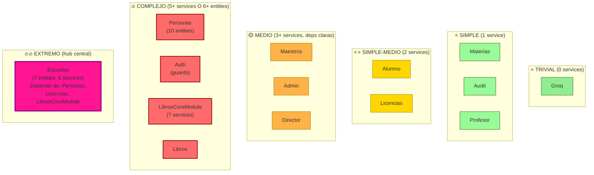
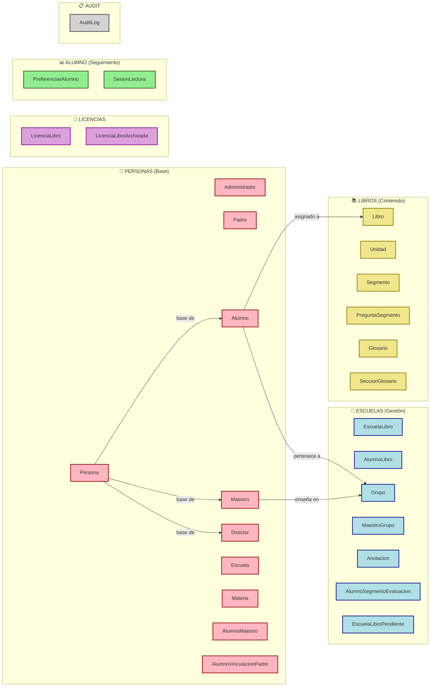

# 📊 Diagramas de Dependencias - ApiLector Módulos

## Diagrama 1: Flujo de Dependencias Completo



---

## Diagrama 2: Árbol de Dependencias (Escuelas como centro)



---

## Diagrama 3: Orden de Migración Recomendado

```mermaid
graph LR
    subgraph Fase1["⏱️ Fase 1: Fundación<br/>(1-2 días)"]
        A1["1. Groq"]
        A2["2. Materias"]
        A3["3. Audit"]
        A4["4. Alumno"]
        A5["5. Profesor"]
    end

    subgraph Fase2["⏱️ Fase 2: Base<br/>(2-3 días)"]
        B1["6. Personas"]
        B2["7. Auth"]
    end

    subgraph Fase3["⏱️ Fase 3: Libros<br/>(3-5 días)"]
        C1["8. Licencias"]
        C2["9. LibrosCoreModule"]
        C3["10. Libros"]
    end

    subgraph Fase4["⏱️ Fase 4: Hub<br/>(3-4 días)"]
        D1["11. Escuelas"]
    end

    subgraph Fase5["⏱️ Fase 5: Apps<br/>(2-3 días)"]
        E1["12. Maestros"]
        E2["13. Admin"]
        E3["14. Director"]
    end

    Fase1 --> Fase2
    Fase2 --> Fase3
    Fase3 --> Fase4
    Fase4 --> Fase5

    classDef f1 fill:#90EE90,stroke:#2d5016,stroke-width:2px
    classDef f2 fill:#FFD700,stroke:#8B7500,stroke-width:2px
    classDef f3 fill:#FF6B6B,stroke:#8B0000,stroke-width:2px
    classDef f4 fill:#FF1493,stroke:#8B008B,stroke-width:3px
    classDef f5 fill:#87CEEB,stroke:#00008B,stroke-width:2px

    class Fase1,A1,A2,A3,A4,A5 f1
    class Fase2,B1,B2 f2
    class Fase3,C1,C2,C3 f3
    class Fase4,D1 f4
    class Fase5,E1,E2,E3 f5
```



---

## Diagrama 4: Matriz de Complejidad



---

## Diagrama 5: Ciclo de Vida de Entidades



---

## Tabla Comparativa: Esfuerzo de Migración

| Módulo | Servicios | Entidades | Deps | Complejidad | Duración | Riesgo |
|--------|-----------|-----------|------|-------------|----------|--------|
| Groq | 1 | 0 | 0 | ⭐ | 2h | Muy bajo |
| Materias | 1 | 1 | 0 | ⭐ | 2h | Muy bajo |
| Audit | 1 | 1 | 0 | ⭐ | 2h | Muy bajo |
| Alumno | 2 | 2 | 0 | ⭐ | 3h | Muy bajo |
| Profesor | 1 | 0 | 0 | ⭐ | 2h | Muy bajo |
| Licencias | 2 | 2 | 0 | 🟡 | 4h | Bajo |
| Maestros | 1 | 0 | 1 | 🟡 | 3h | Bajo |
| Admin | 1 | 0 | 2 | 🟡 | 4h | Medio |
| Director | 1 | 0 | 2 | 🟡 | 4h | Medio |
| **Personas** | **5** | **10** | **1** | **🔥** | **8h** | **Medio** |
| **Auth** | **2** | **2** | **1** | **🔥** | **6h** | **Medio** |
| **LibrosCoreModule** | **7** | **6** | **1** | **🔥** | **12h** | **Alto** |
| **Libros** | **1** | **0** | **2** | **🔥** | **6h** | **Alto** |
| **Escuelas** | **6** | **7** | **3** | **🔥🔥** | **12h** | **Alto** |

---

## Checklist de Migración por Módulo

### ✅ Groq
- [ ] Convertir service de TypeORM a Prisma
- [ ] Actualizar inyecciones de dependencia
- [ ] Tests unitarios

### ✅ Materias
- [ ] Migrar TypeORM a Prisma
- [ ] Actualizar CRUD operations
- [ ] Tests

### ✅ Audit
- [ ] Migrar TypeOrmModule a Prisma
- [ ] Actualizar AuditService
- [ ] Verificar interceptor HTTP
- [ ] Tests

### ✅ Alumno
- [ ] Migrar 2 entities (PreferenciasAlumno, SesionLectura)
- [ ] Actualizar 2 servicios
- [ ] Validar controllers

### ✅ Profesor
- [ ] Migrar service
- [ ] Actualizar queries de lectura (no escriben)

### 🟡 Licencias
- [ ] Migrar 2 entities
- [ ] Actualizar 2 servicios
- [ ] Validar relaciones con Escuelas

### 🟡 Maestros
- [ ] Migrar service
- [ ] Validar dependencia con EscuelasModule

### 🟡 Admin
- [ ] Migrar service
- [ ] Validar dependencias (Personas + Escuelas)

### 🟡 Director
- [ ] Migrar service
- [ ] Validar dependencias (Personas + Escuelas)

### 🔥 Personas
- [ ] Migrar 10 entities (incluyendo herencia)
- [ ] Migrar 5 servicios
- [ ] Validar relaciones complejas
- [ ] Tests integrales
- [ ] Validar AuthModule

### 🔥 Auth
- [ ] Migrar Auth service
- [ ] Mantener JwtStrategy y guards
- [ ] Validar dependencia de Personas

### 🔥 LibrosCoreModule
- [ ] Migrar 7 servicios
- [ ] Migrar 6 entities
- [ ] Preservar lógica de procesamiento de PDFs
- [ ] Validar integración con Groq
- [ ] Tests de procesamiento

### 🔥 Libros
- [ ] Migrar HTTP service
- [ ] Validar libros.controller
- [ ] Validar dependencias (Escuelas + LibrosCoreModule)

### 🔥🔥 Escuelas (CRÍTICO)
- [ ] Migrar 7 entities
- [ ] Migrar 6 servicios
- [ ] Validar 3 controllers
- [ ] Validar dependencias (Personas, Licencias, LibrosCoreModule)
- [ ] Validar uso desde: Libros, Maestros, Admin, Director
- [ ] Tests integrales (100% coverage para relaciones)
- [ ] Smoke tests de todo el sistema

---

## Notas de Implementación

### Orden estricto recomendado:
```
Fase 1: Groq → Materias → Audit → Alumno → Profesor
    ↓
Fase 2: Personas → Auth
    ↓
Fase 3: Licencias → LibrosCoreModule → Libros
    ↓
Fase 4: Escuelas (PUNTO CRÍTICO)
    ↓
Fase 5: Maestros → Admin → Director
```

### Validaciones necesarias en cada fase:
1. ✅ TypeScript compilation limpia
2. ✅ Tests unitarios pasan (del módulo)
3. ✅ No hay imports rotos
4. ✅ Database schema matches
5. ✅ Runtime: servicio inicia sin errores

### Rollback plan:
- Mantener TypeORM comentado en package.json
- Crear branch por módulo
- Validar en test environment antes de production
